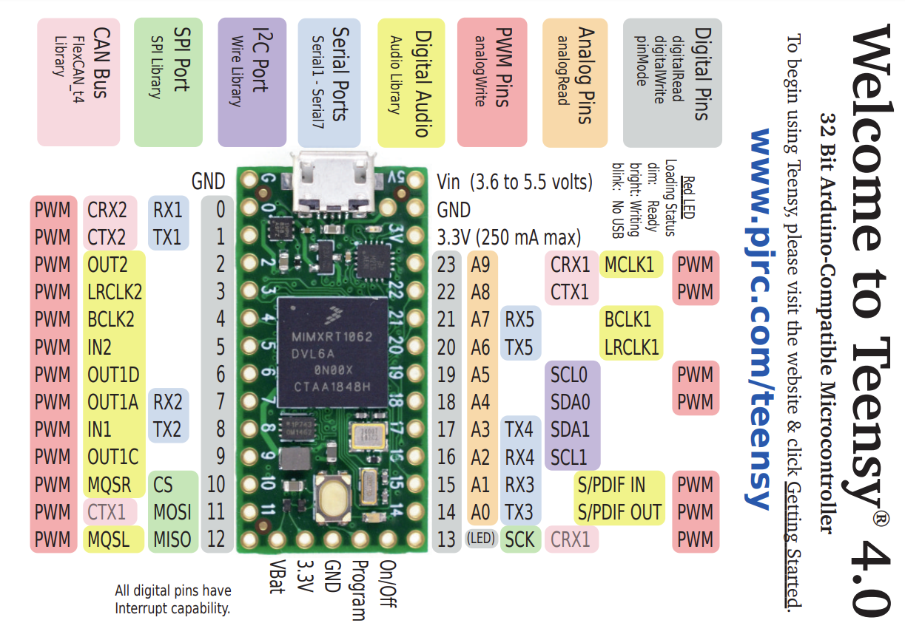

# Notes

[Teensy 4.0 board external link](https://www.pjrc.com/teensy/card10a_rev2_web.pdf)

Here is a simple flow chart:

This sentence uses `$` delimiters to show math inline:  $\sqrt{3x-1}+(1+x)^2$

**The Cauchy-Schwarz Inequality**

$$\left( \sum_{k=1}^n a_k b_k \right)^2 \leq \left( \sum_{k=1}^n a_k^2 \right) \left( \sum_{k=1}^n b_k^2 \right)$$

## How to write warning in pandoc

| Command | Description |
| --- | --- |
| git status | List all new or modified files |
| git diff | Show file differences that haven't been staged |
